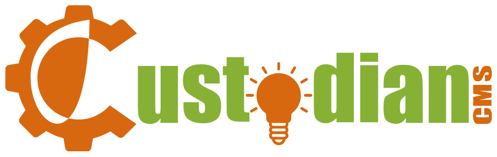

<h1 align="center">Custodian CMS Download</h1>

Some of the code for this utility comes from Marko Marković's project the [Simple PHP Git deploy script](https://github.com/markomarkovic/simple-php-git-deploy).

[Custodian CMS](https://github.com/modusinternet/Custodian-CMS) (CCMS) is a PHP driven Content Management System (CMS) designed to help build and maintain multilingual websites.

The CCMS Download script is a single template designed to help test your server environment and download the latest version of the CCMS repo easily. It saves you the trouble of downloading the compressed files or running composer and installing them yourself by hand.

## System Requirements
* PHP v5.6+
* `git` and `rsync` are required on the server that's running the script.
	- Optionally: `tar` is required for backup functionality (`BACKUP_DIR` option).
	- Optionally: `composer` is required for composer functionality (`USE_COMPOSER` option).
* System user running PHP (e.g. `www-data`) needs to have the necessary access permissions to the `TMP_DIR` and `TARGET_DIR` locations.

## Instructions
Download a copy of the ccms-download.php template to the folder on your server you want to install CCMS, make changes to any #define variables your require and don't forget to change the SECRET_ACCESS_TOKEN (SAT) variable to something only you know and call it from your browser. ie:
https://example.com/?sat=YourSATString

Note: If you have already installed CCMS and just want to see your templates, you need to make sure you have either rename or remove the /ccms-downlaod.php template from the TARGET_DIR of your server first.

## Gotchas
Calling ccms-download.php without the SAT variable, forgetting to update it to something other than the default or mistyping it in your URI will result in an 'ACCESS DENIED!' error message. Just double check your work and try again.

CCMS project website: https://custodiancms.org (Under development)
